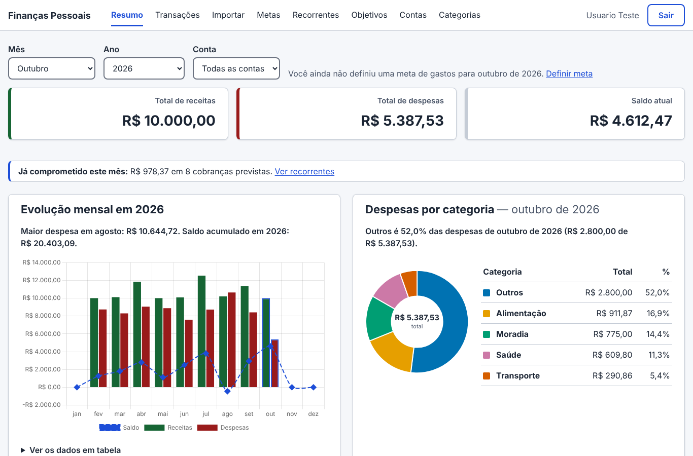
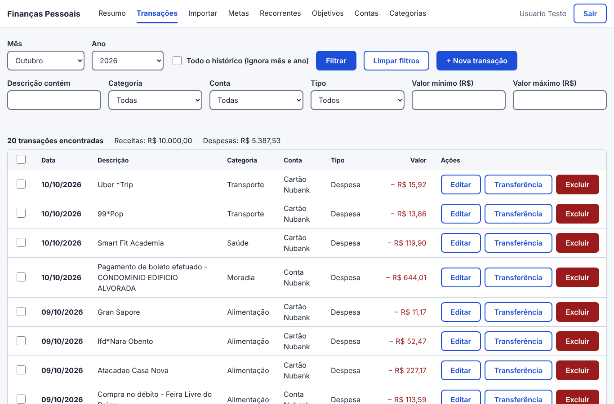

# Finanças Pessoais — Projeto Integrador II (Univesp)

Plataforma web de baixo atrito para o controle de finanças pessoais, desenvolvida no Projeto Integrador em Computação II
(PJI240) da Univesp, 2º semestre de 2026.

- **Polo:** São Paulo – Butantã – UNICEU
- **Aplicação publicada:** _em preparação (Railway)_

Stack: **Angular 22** (frontend) + **Express/Prisma** (backend) + **MySQL 8**.

```
backend/    API REST (Express, TypeScript, Prisma)
frontend/   SPA Angular (standalone, signals) servida pelo Nginx
e2e/        testes de ponta a ponta no navegador (Playwright)
docker-compose.yml   MySQL + backend + frontend (Nginx)
```

| Resumo | Transações |
|---|---|
|  |  |

Pré-requisitos: Docker Desktop e, para o modo hot-reload, Node 24.

## Configuração inicial (uma vez)

```powershell
Copy-Item .env.example .env.local   # ajuste as senhas/JWT_SECRET se quiser
```

Se o build falhar com `UNABLE_TO_VERIFY_LEAF_SIGNATURE` (antivírus/proxy que inspeciona TLS, como o Norton),
descomente `EXTRA_CA_FILE` no `.env.local` apontando para o `.pem` da CA.

## Modo integração — tudo em containers

Use para testar o sistema como um todo (é o mais próximo da produção).

```powershell
docker compose --env-file .env.local up --build -d
```

| O quê | Onde |
|---|---|
| Aplicação | http://localhost:4200 |
| API (direto) | http://localhost:3000/api |
| Swagger | http://localhost:4200/api-docs/ (ou :3000/api-docs) |
| MySQL | `localhost:3306` (usuário/senha do `.env.local`) |

O backend só sobe depois do MySQL ficar saudável e, ao iniciar, roda `prisma migrate deploy` e o seed das categorias.
O Nginx do frontend encaminha `/api` para o backend (mesma origem, sem CORS).

```powershell
docker compose --env-file .env.local logs -f backend   # logs
docker compose --env-file .env.local down               # para (mantém os dados)
docker compose --env-file .env.local down -v            # para e apaga os dados do MySQL
```

## Modo hot-reload — dia a dia de desenvolvimento

Só o MySQL em Docker; backend e frontend rodam na máquina e recarregam ao salvar.

```powershell
docker compose --env-file .env.local up mysql -d

# terminal 2
cd backend
npm install
npm run db:deploy      # aplica migrations
npm run db:seed        # categorias fixas (idempotente)
npm run dev            # http://localhost:3000

# terminal 3
cd frontend
npm install
npm start              # http://localhost:4200 (usa http://localhost:3000/api)
```

`backend/.env` deve ter `DATABASE_URL` apontando para `localhost:3306` com o usuário/senha do `.env.local`
(veja `backend/.env.example`). Não rode os dois modos ao mesmo tempo: as portas 3000 e 4200 são as mesmas.

## Importar extrato e fatura (OFX)

Em **Importar** (menu superior), envie o arquivo OFX do extrato da conta ou da fatura do cartão. O app mostra
cada lançamento com a categoria sugerida; revise, troque o que estiver errado e clique em **Importar**.

1. No aplicativo ou site do banco, exporte o **extrato** ou a **fatura** em formato **OFX** (no Nubank, nas telas
   de extrato e de fatura; o caminho exato pode mudar conforme a versão do aplicativo). Um arquivo por vez, até 2 MB.
2. Envie o arquivo na tela **Importar**. Nada é gravado nessa etapa e o arquivo não fica armazenado.
3. Vêm **desmarcados**: o pagamento da fatura (já aparece como compras na fatura) e as transferências entre
   as suas próprias contas (nome do titular igual ao do cadastro). Marque só se quiser importá-los.
4. Reenviar o mesmo arquivo, ou outro com período sobreposto, **não duplica** lançamentos (o `FITID` do OFX é único por usuário).

Dados de teste sem informação pessoal: `cd backend; npm run fixtures:ofx` gera em `backend/tests/fixtures/` uma série
fictícia de jan–set/2026 (ver o README de lá). Para o import reconhecer as transferências entre contas, o nome do
usuário de teste deve ser "Usuario Teste".

## Transações: filtros e edição em massa

Em **Transações** dá para filtrar por descrição, categoria, tipo e faixa de valor (botão **Filtrar**), no mês escolhido ou em
**Todo o histórico**. Marque as transações que quiser (ou todas as listadas) e use a barra que aparece para **mover todas para
outra categoria** ou **excluí-las**. É o caminho para arrumar o que veio da importação, por exemplo trocar tudo o que está em
"Outros" e contém "Netflix" para "Assinaturas". Receitas e despesas não se misturam ao trocar de categoria.

## Regras de categorização

Ao mover transações para outra categoria, o app pergunta se deve **usar sempre** essa categoria para descrições parecidas (o termo é
sugerido e pode ser editado; dá para aplicar também às transações que já existem). Nas próximas importações, essas regras valem antes
das regras do app, e a linha aparece marcada como "regra sua". Em **Categorias** você vê, edita, apaga e aplica ao histórico cada regra.

## Metas

Em **Metas** (menu superior) você escolhe o **mês e o ano** e preenche a **meta de cada categoria** naquele mês; cada mês tem as
suas, porque os gastos variam. A **meta do mês é a soma das metas das categorias** (não há um valor total para digitar), e ela aparece
no topo da tela ao lado do gasto do mês. No **Resumo**, o aviso de orçamento estourado mostra quanto foi gasto no mês e a meta dele; ao
ver o ano inteiro, lista os meses que passaram da própria meta. Mês sem meta não gera aviso, e o Resumo oferece o link para definir uma.

O Resumo avisa em três níveis, com texto e ícone: dentro da meta, **atenção a partir de 80%** e estourada. Em **Copiar para os
próximos meses** você repete as metas por categoria de um mês nos seguintes, preservando ou substituindo as que já existem.

Quem já tinha uma meta total definida antes das metas por categoria continua com ela nos meses em que não há meta por categoria (marcada
como "antiga", com o botão "Remover esta meta"). Assim que uma categoria recebe meta, a soma passa a valer.

## Insights no Resumo

O card **"O que chamou atenção"** traz até 5 frases sobre o mês (categoria que subiu ou caiu contra a média dos 3 meses anteriores, maiores despesas, total contra o mês passado, projeção do fim do mês, muito gasto em Outros, reajuste de assinatura). Tudo por regras fixas, sem IA. Cada frase tem um link que abre as Transações já filtradas.

## Recorrentes

A tela **Recorrentes** encontra sozinha o que se repete todo mês (assinaturas, mensalidades) e mostra o custo fixo por mês e por ano, a próxima cobrança prevista, reajustes e o que ainda será cobrado no mês. Se a detecção errar, use "Não é recorrente" (dá para desfazer).

## Objetivos

Em **Objetivos** você cria uma meta de reserva (valor e prazo), registra quanto já guardou e vê quanto precisa guardar por mês para chegar lá, além de estar no ritmo, atrasado ou concluído. Os aportes são manuais. O Resumo mostra o progresso de cada objetivo.

## Contas e transferências

Em **Contas** você cadastra conta corrente, cartão e dinheiro. Cada transação pertence a uma conta; o cartão mostra o valor **a pagar**. Na importação, o app reconhece a conta pelo banco/conta que vem no OFX (ou oferece criar uma). Pagamento de fatura e movimentos entre contas são **transferências**: mudam os saldos, mas não contam como receita nem despesa em resumo, gráficos, metas e insights. As telas Transações e Resumo ganham o filtro por conta quando há mais de uma.

## Categorias

Além das categorias padrão (Alimentação, Moradia, Salário etc.), em **Categorias** você cria as suas (por exemplo, Pets ou
Assinaturas) para não jogar tudo em "Outros". Elas aparecem só para você: no cadastro de transações, na importação de extratos e
nos gráficos. Dá para renomear e excluir as suas; a exclusão é bloqueada enquanto houver transações na categoria.

## Minha conta e dados pessoais (LGPD)

Clicando no nome, no topo, a pessoa vê os próprios dados e pode **excluir a conta**: a confirmação pede a senha de novo e
apaga a conta com tudo o que ela guarda (transações, contas, categorias próprias, metas, regras, objetivos e aportes).
É o direito de eliminação da LGPD (Lei 13.709/2018, art. 18). Os extratos OFX são lidos só em memória e nunca gravados em disco.

## Segurança

- Senhas com bcrypt, JWT com expiração e consultas sempre parametrizadas (Prisma).
- Limite de tentativas por IP: login (só as tentativas com erro contam) e cadastro. Atrás de proxy, `TRUST_PROXY` diz quantos
  proxies existem na frente da API (Nginx = 1, padrão; Railway = 2), para o limite enxergar o IP real.
- Cabeçalhos de segurança: `helmet` na API e `nosniff`, `X-Frame-Options`, `Referrer-Policy` e `Permissions-Policy` nas páginas.
- Dependabot (atualizações semanais) e CodeQL (análise estática) no GitHub.

## Testes

```powershell
# Backend (a integração contra MySQL real só roda com DATABASE_URL_TEST)
cd backend
$env:DATABASE_URL_TEST = "mysql://app:<MYSQL_PASSWORD>@localhost:3306/financas"
npm test
npm run lint

# Frontend (inclui testes de acessibilidade com axe-core em todas as telas)
cd frontend
npm test -- --watch=false
npm run lint

# Ponta a ponta no navegador, com o modo integração de pé (http://localhost:4200)
cd e2e
npm install
npx playwright install chromium
npm run test:e2e
```

Os testes de integração criam e removem os próprios usuários (e-mails `*@teste.com`), então podem rodar no banco de desenvolvimento.
Cada teste E2E cria o próprio usuário (`*@example.com`); detalhes em `e2e/README.md`. Para rodá-los contra a aplicação
publicada: `$env:BASE_URL = "https://<endereço>"`.

No GitHub Actions, cada push roda lint, testes e build do backend e do frontend, sobe o stack inteiro no Docker Compose, faz o
teste de fumaça pela API e roda os testes E2E no Chromium.

## Teste com a comunidade (contas demo)

Para ninguém precisar digitar dados financeiros reais, há contas de demonstração com os extratos e faturas **fictícios** de
`backend/tests/fixtures` (janeiro a setembro de 2026, deslocados para terminar no mês atual):

```powershell
cd backend
$env:DATABASE_URL = "<URL do MySQL>"          # local ou o do Railway
$env:DEMO_SENHA = "<senha das contas demo>"   # não vai para o repositório
npm run demo:criar -- --quantidade 5          # demo1@financas.demo ... demo5@financas.demo

# Ao final do teste
npm run demo:limpar                           # só lista o que seria apagado
npm run demo:limpar -- --confirmar            # apaga as contas demo e os dados delas
npm run demo:limpar -- --confirmar --todos    # apaga TODOS os usuários (banco do teste)
```

## Deploy no Railway

O projeto já está pronto para a publicação em três serviços no mesmo projeto do Railway:

| Serviço | Origem | Variáveis |
|---|---|---|
| MySQL | banco gerenciado do Railway | — |
| backend | este repositório, pasta `backend` (Dockerfile) | `PORT=3000`; `DATABASE_URL` = a URL interna do MySQL; `JWT_SECRET` (32+ caracteres aleatórios); `TRUST_PROXY=2`; `CORS_ORIGIN` = o domínio público do frontend |
| frontend | este repositório, pasta `frontend` (Dockerfile) | `BACKEND_URL` = `http://<nome-do-backend>.railway.internal:3000` |

- Só o **frontend** recebe domínio público: o Nginx dele atende o Angular e encaminha `/api` para o backend pela rede privada.
- No frontend, o Railway define `PORT` sozinho e o Nginx já lê essa variável. No backend, `PORT=3000` fixa a porta que o
  `BACKEND_URL` usa.
- Healthcheck do backend: `/api/health` (consulta o banco).
- Ao subir, o backend aplica as migrations (`prisma migrate deploy`) e o seed das categorias.
- Depois do primeiro deploy, crie as contas demo apontando `DATABASE_URL` para a URL pública do MySQL do Railway e rode os
  testes E2E com `BASE_URL` para conferir a publicação.
